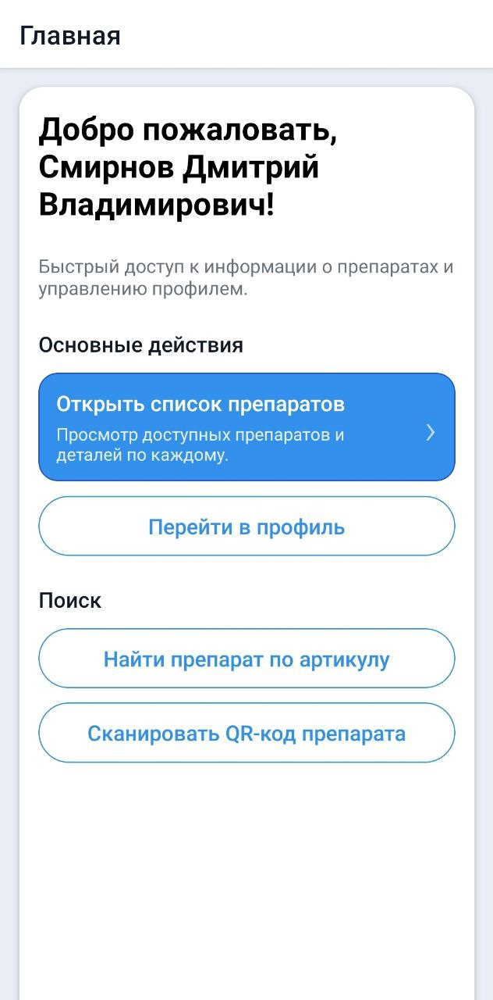
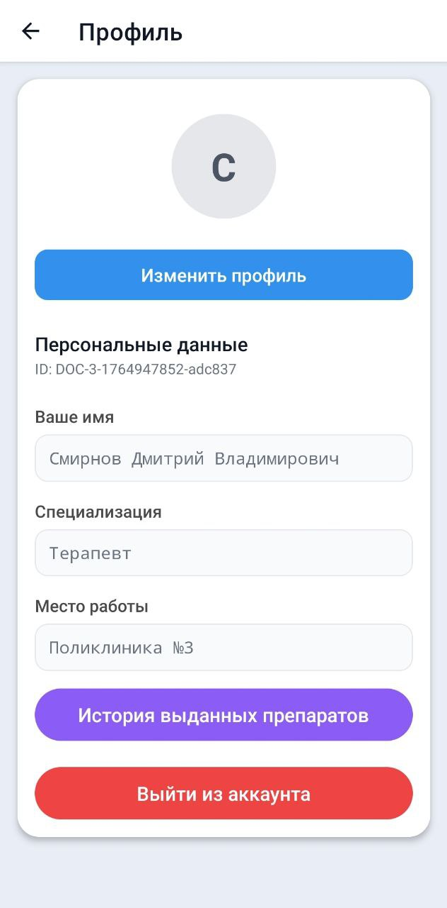
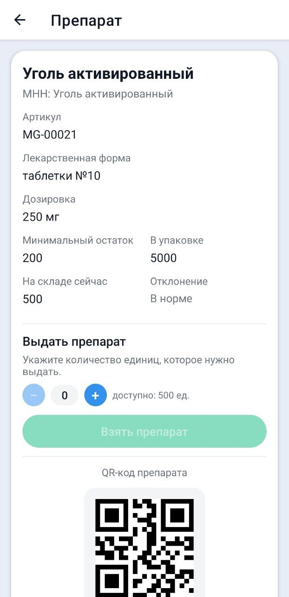

# MedGuide

Мобильное приложение для управления медицинскими препаратами и выданными лекарствами.

## О проекте

MedGuide - это React Native приложение, построенное на Expo, с Django REST API backend. Приложение позволяет:
- Просматривать каталог медицинских препаратов
- Сканировать коды лекарств
- Выдавать препараты пациентам
- Ведение истории выданных лекарств
- Управление профилем врача

## Скриншоты

<div style="display: flex; gap: 16px;">
  
  
  
</div>


## Технологии

### Frontend
- React Native (Expo)
- TypeScript
- React Navigation
- Expo SQLite (локальное кэширование)

### Backend
- Django REST Framework
- PostgreSQL
- Docker

## Требования

- Node.js 18+
- Python 3.12+
- Docker и Docker Compose (для backend)
- Expo CLI или EAS CLI (для сборки)

## Быстрый старт

### 1. Клонирование репозитория

```bash
git clone <repository-url>
cd react-medguide
```

### 2. Установка зависимостей Frontend

```bash
npm install
```

### 3. Настройка Backend

Перейдите в папку `backend` и следуйте инструкциям в [backend/README.md](./backend/README.md):

```bash
cd backend
cp env.example .env
# Отредактируйте .env файл
docker-compose up -d
```

### 4. Настройка API URL

Создайте файл `.env` в корне проекта:

```env
EXPO_PUBLIC_API_URL=http://localhost:8000/api/
```

Или используйте EAS Secrets для production:

```bash
eas secret:create --scope project --name EXPO_PUBLIC_API_URL --value "http://your-server:8000/api/"
```

### 5. Запуск приложения

```bash
# Запуск Expo dev server
npm start

# Запуск на Android
npm run android

# Запуск на iOS
npm run ios

# Запуск на Web
npm run web
```

## Тестирование

```bash
# Запуск тестов
npm test

# Запуск тестов в watch режиме
npm run test:watch

# Генерация coverage отчета
npm run test:coverage
```

## Структура проекта

```
react-medguide/
├── src/                    # Исходный код приложения
│   ├── api/               # API клиенты
│   ├── screens/          # Экраны приложения
│   ├── navigation/       # Навигация
│   ├── services/         # Сервисы
│   ├── hooks/            # React hooks
│   └── types/            # TypeScript типы
├── backend/              # Django backend
│   ├── chat/            # Приложение профилей
│   ├── medicines/       # Приложение препаратов
│   └── medguide_backend/ # Настройки Django
├── assets/              # Иконки и изображения
├── app.json            # Конфигурация Expo
├── eas.json            # Конфигурация EAS Build
└── package.json        # Зависимости Node.js
```
